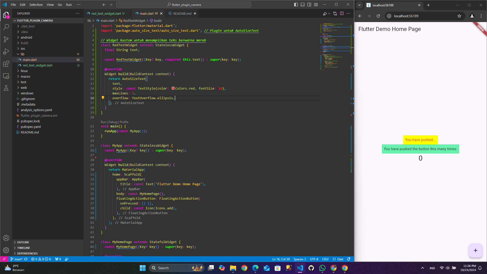

Langkah 2: Penjelasan
Langkah 2 bertujuan untuk menggunakan plugin auto_size_text agar teks dapat otomatis menyesuaikan ukuran container, mencegah teks terpotong atau melebihi batas container.

Langkah 5: Penjelasan
Langkah 5 menambahkan variabel text dan parameter di constructor untuk memungkinkan widget RedTextWidget menerima teks dinamis yang dapat diubah saat dipanggil.

Langkah 6: Fungsi dan Perbedaan Dua Widget
RedTextWidget: Menggunakan AutoSizeText agar teks menyesuaikan ukuran container secara otomatis.
Text: Menampilkan teks biasa tanpa penyesuaian otomatis, ukuran teks harus diatur secara manual.
Penjelasan Parameter Plugin auto_size_text:
text: Teks yang akan ditampilkan.
style: Mengatur gaya teks (warna, ukuran font, dll.).
maxLines: Batas maksimal baris teks yang bisa ditampilkan.
overflow: Menentukan bagaimana teks yang terpotong ditampilkan 
